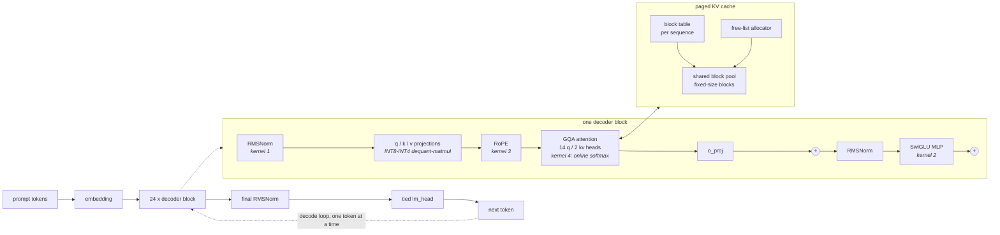

# nano-infer

A single-GPU LLM inference engine written from scratch — four custom CUDA kernels
and INT8/INT4 quantization — that loads an open-weights transformer and generates
tokens **without** `model.generate()`, vLLM, TensorRT-LLM, or FlashAttention.

It is the GPU-worker layer beneath [MiniDynamo](https://github.com/NathanS7878/MiniDynamo),
a distributed KV-cache-aware inference router. MiniDynamo decides *which worker*
runs a request; nano-infer is what that worker actually does on the GPU.

> **Status: Phases 0–5 complete**, on two models. 165 tests passing on
> Qwen2.5-0.5B/fp16, 164 on Qwen2.5-1.5B/bf16.
> Full write-up: **[SUMMARY.md](SUMMARY.md)** — what was built, what was measured,
> and what went wrong. One lesson in depth: **[WRITEUP.md](WRITEUP.md)**.
> Current state: [ROADMAP.md](ROADMAP.md). Dated log: [PROGRESS.md](PROGRESS.md).
> MIT licensed.

## The benchmark table

**Qwen2.5-0.5B-Instruct, fp16, RTX 3070, 32-token prompt, 64 new tokens, greedy.**
Median of 3 runs after 2 discarded warmups. Every row is reproducible by a
script in this repo.

| Engine | tok/s @ batch 1 | tok/s @ batch 32 | vs HF | Reproduce |
|---|---|---|---|---|
| HuggingFace `generate()` | 24.5 | 756.8 | 1.00× | `python -m bench.phase2_cache` |
| nano-infer, no cache (Phase 1) | 25.4 | 53.3 | 0.07× | `python -m bench.phase1_nocache` |
| nano-infer, paged KV cache (Phase 2) | 24.8 | 749.2 | 0.99× | `python -m bench.phase2_cache` |
| nano-infer + custom kernels (Phase 3) | 57.7 | 1694.4 | 2.24× | `python -m bench.phase3_end_to_end` |
| nano-infer + INT8 weights (Phase 4) | 69.0 | 1325.1 | 1.75× | `python -m bench.quant_acceptance` |
| nano-infer + kernels + CUDA-graph decode, capture every call | 184.2 | 5141.4 | 6.79× | `python -m bench.decode_graph_runner` |
| **nano-infer + kernels + CUDA-graph decode, capture once** | **267.3** | **7114.2** | **9.40×** | `python -m bench.decode_graph_runner` |
| vLLM | — | — | — | **not run — see below** |

**Every row above is from one session on an idle GPU** (0% utilization, 140–262
MiB held at start), which is why the "vs HF" column is quoted without a
tolerance. An earlier version of this table mixed sessions — the CUDA-graph rows
came from a later run than the HF row — and carried a ~10% caveat on that
column, because cross-session numbers on this desktop move by several percent
(ROADMAP #18, #21). Re-running every row together removed the caveat instead of
restating it, and moved the headline from 9.67× to **9.40×**. "Capture once"
reuses one `DecodeGraphRunner`, as a server handling one request shape would;
every timed call still gets a different prompt.

The same numbers on the **benchmark model, Qwen2.5-1.5B**, are
[below](#the-benchmark-model-qwen25-15b) — including this project's best
bandwidth figure, **78.3% of peak**.

**The INT8 row is faster at batch 1 and slower at batch 32, and that is the
point.** It is not a worse engine; it is a different trade. See
[Quantization](#quantization-what-it-costs).

### The benchmark model: Qwen2.5-1.5B

The spec calls 0.5B the *dev* model and 1.5B the *benchmark* model. Same engine,
same code, one environment variable:

```
NANO_INFER_MODEL=Qwen/Qwen2.5-1.5B-Instruct python -m bench.decode_graph_runner
```

`config.py` reads the architecture and the dtype from the checkpoint rather than
assuming the dev model's, and refuses any config the engine does not implement.
**Qwen2.5-1.5B runs in bf16, not fp16** — its raw attention product q·k reaches
264,115 and fp16 tops out at 65,504, so an fp16 load produces NaN. So does
HuggingFace's, which is how that was pinned on the dtype rather than on this
engine (ROADMAP #41).

**Qwen2.5-1.5B-Instruct, bf16, RTX 3070, 32-token prompt, 64 new tokens, greedy,
idle GPU.** Results in [`results/qwen2.5-1.5b-bf16/`](results/qwen2.5-1.5b-bf16/).

| Engine | tok/s @ batch 1 | tok/s @ batch 32 | vs HF | Reproduce |
|---|---|---|---|---|
| HuggingFace `generate()` | 20.6 | 646.1 | 1.00× | `python -m bench.phase2_cache` |
| nano-infer, paged KV cache (Phase 2) | 21.2 | 650.0 | 1.01× | `python -m bench.phase2_cache` |
| nano-infer + custom kernels (Phase 3) | 49.0 | 1410.2 | 2.18× | `python -m bench.phase3_end_to_end` |
| nano-infer + kernels + CUDA-graph decode, capture every call | 90.3 | 2428.5 | 3.76× | `python -m bench.decode_graph_runner` |
| **nano-infer + kernels + CUDA-graph decode, capture once** | **108.5** | **2844.2** | **4.40×** | `python -m bench.decode_graph_runner` |

Unlike the 0.5B table, every row here was measured in one session on an idle
GPU, so the "vs HF" column does not carry the cross-session uncertainty
discussed above.

**The bandwidth number improves with the bigger model: 350.6 GB/s at batch 1,
78.3% of this card's 448 GB/s peak** (`python -m bench.quant_graph`), against
64% on 0.5B. Decode is weight-bandwidth-bound, and a 3.1 GB model amortises the
per-step fixed costs over twice the bytes that a 1.0 GB model does.

#### Quantization on 1.5B, and what the bigger model changes

| Precision | Weights | Compression | bits/wt | tok/s @1 | tok/s @32 | Peak VRAM | Perplexity | vs bf16 |
|---|---|---|---|---|---|---|---|---|
| bf16 | 3087 MB | 1.00× | 16.00 | 48.9 | **1388.2** | 3103 MiB | 15.11 | — |
| **INT8** | 1778 MB | 1.74× | 8.01 | **57.0** | 401.7 | 1855 MiB | 15.13 | +0.17% |
| INT4 g128 | 1153 MB | 2.68× | 4.19 | 52.8 | 272.9 | **1290 MiB** | 17.81 | +17.90% |

The bf16 perplexity baseline is **15.11 ± 3.24% (1 s.e.)**, so INT8's +0.17% is
again *lossless within measurement precision*. Three things are different at
this size, all of them measured:

- **INT4 costs less, not more.** +17.90% perplexity here against **+20.97%** on
  0.5B. Bigger models carry more redundancy per weight, so the same 4-bit grid
  throws away proportionally less. The group-size sweep moves the same way:
  g32 +10.73%, g64 +14.12%, g128 +17.90% (`python -m bench.perplexity`).
- **Whole-model compression is better** — 2.68× against 2.15× — for a reason
  that has nothing to do with the quantizer. The tied embedding stays in bf16
  and is a *smaller share* of a bigger model: 27.6% of 0.5B, 15% of 1.5B. The
  quantized tensors themselves compress identically at both sizes.
- **The batch crossover gets worse.** INT8 at batch 32 is 0.29× the bf16 engine
  here against 0.79× on 0.5B. The fused dequant-matmul accumulates in scalar
  fp32 while cuBLAS rides tensor cores, so the wider the matrix the sooner
  cuBLAS wins — and 1.5B's matrices are wider. Under CUDA graphs at batch 1 the
  trade is still clearly good: INT8 decode is **1.61× the bf16 graph engine**,
  at 324.2 GB/s.

### The vLLM row is missing, and here is why

Rule 2 of this project is that vLLM is benchmarked *against*, never imported —
so a vLLM row belongs here. It could not be produced on this machine: vLLM
publishes **no Windows wheels**, and `pip install vllm` falls back to a source
build that fails to even unpack under Windows path-length limits. vLLM's
supported platform is Linux. Rather than quote a number from someone else's
hardware and pretend it is comparable, the row is left empty and labelled.

## Hardware

Every number in this repo comes from one machine: **NVIDIA GeForce RTX 3070**
(8 GB, Ampere sm_86, **448 GB/s** peak bandwidth, ~364 FLOP/byte roofline ridge).
Full spec, driver and toolchain: [HARDWARE.md](HARDWARE.md).

That 448 GB/s is the denominator for every bandwidth claim below. This machine
also runs a desktop, and benchmarks are only trusted when `nvidia-smi` reports
the GPU idle — a contended run produced ratios that disagreed with each other by
30% (ROADMAP gotcha #18).

## Architecture



Requests enter a **continuous-batching** scheduler: sequences join and leave the
running batch as they finish rather than waiting for the slowest one. Attention
reads the paged block table **in place**, so the gather copy that paging
normally pays each step is removed.

## What was built, phase by phase

| Phase | Result |
|---|---|
| **0 — Ground truth** | Benchmark harness (CUDA-synced, warmups discarded), HF baseline, committed reference fixture |
| **1 — Correct but slow** | Full forward pass from raw safetensors. Every component **bit-identical** to HF eager; token-for-token match on 5 prompts × 50 tokens |
| **2 — KV cache & batching** | Contiguous → paged cache (**3.8× fewer slots held**, 4.4% fragmentation) → continuous batching (**1.55×** on a request stream, slot utilization 46% → 100%) |
| **3 — Custom CUDA kernels** | Four kernels, **2.33× end-to-end** |
| **4 — Quantization** | INT8 lossless & 1.57× smaller; INT4 2.15× smaller, **1.99× less peak VRAM** |

### The four kernels

Measured against PyTorch on the same op. **% of peak** is achieved memory
bandwidth against 448 GB/s — the honest metric for a memory-bound kernel, since
"faster than PyTorch" says nothing about how much room is left.

| Kernel | Speedup | % of peak | Predicted ceiling | Reproduce |
|---|---|---|---|---|
| 1. Fused RMSNorm | 7.66× | 75.5% | — | `python -m bench.kernel_rmsnorm` |
| 2. Fused SwiGLU | 1.65× | 89.5% | 1.67× ✓ | `python -m bench.kernel_swiglu` |
| 3. Fused RoPE | 5.03× | 87.6% | 5.00× ✓ | `python -m bench.kernel_rope` |
| 4. Decode attention, per query head | 2.52× | 11.1% | ~24× ✗ | `python -m bench.kernel_attention` |
| 4b. Decode attention, head-grouped | **6.89×** | **30.3%** | — | `python -m bench.kernel_attention` |

Kernels 2 and 3 landed within 1% of a ceiling derived by counting bytes before
any code was written. **Kernel 4 missed by 10×**, and finding out why is the
subject of [WRITEUP.md](WRITEUP.md).

Kernel 4b is the answer to that miss. The "11.1% of peak" is computed against
*compulsory* bytes — each KV element counted once — but with GQA 14q/2kv the
kernel launched one block per query head, so seven blocks each read the same KV
rows. Against the bytes it actually **issued**, it was already at 76% of peak
(`python -m bench.kernel_attention --sharing` is the experiment that shows this:
hold block count and per-block work fixed, vary only the distinct footprint, and
wall time goes flat). It was never 11% of the card. It was a load path near its
ceiling carrying 7× more traffic than the algorithm needs. So 4b gives one block
all seven query heads that share a KV head, reads each K and V element once into
a register, and feeds it to all seven — **2.60× on the kernel, at identical
numerical error.**

## Removing the host from the decode loop

The eager decode step turned out to be host-bound: ~20 ms per step whether the
batch was 1 or 32 and the context 33 or 1025 tokens — ~3,200 aten dispatches and
65 GPU→host synchronisations per step. `nano_infer/decode_graph.py` builds a
decode step with no host inputs at all (every KV block allocated up front, all
bookkeeping derived on the GPU), then captures it as a CUDA graph. Reproduce:
`python -m bench.decode_graph`.

Decode ms/step, kernels on, on an idle GPU (0% utilization, 140 MiB held at
start):

| Batch | Prompt | Eager paged | Eager, syncs removed | **CUDA graph** | Speedup |
|---|---|---|---|---|---|
| 1 | 32 | 16.93 | 15.65 | **3.34** | **5.07×** |
| 4 | 32 | 17.98 | 16.39 | **3.59** | **5.00×** |
| 16 | 32 | 18.57 | 16.41 | **3.70** | **5.02×** |
| 32 | 32 | 19.10 | 16.43 | **4.03** | **4.75×** |
| 32 | 512 | 19.33 | 16.36 | **5.17** | **3.74×** |
| 8 | 1024 | 17.77 | 15.95 | **4.71** | **3.77×** |

Two things this separated that one number would have hidden. Removing all 65
syncs alone bought only **1.08–1.18×** — dispatch, not synchronisation, was the
cost. And once graphed, a batch-1 step streams **988 MB of weights at 66.0% of
peak bandwidth** (the eager engine: 13.1%), with step time finally growing with
context — decode is now bound by the GPU, which is where the kernels live.
Token output is identical to the eager engine with kernels on.

That 3.34 ms is corroborated by `bench.quant_graph`, a separate script with its
own timing loop, to the same two decimals. On Qwen2.5-1.5B the same batch-1
graphed step reaches **78.3% of peak** — a 3.1 GB model amortises the per-step
fixed costs over twice the bytes.

This table was measured three times: first on a contended desktop (23%
utilization) with every arm run round-robin so the ratios would survive, then
twice more as the machine got quieter. The ratios moved by a few percent and
never changed the conclusion (batch 32: 5.28× contended, 4.94×, 4.75× idle) —
which is the argument for round-robin arms, not for trusting a contended
absolute.

Capture costs 0.11–0.21 s, so it has to be paid once, not per call. A reused
`DecodeGraphRunner` (`python -m bench.decode_graph_runner`) takes a batch-32
call from **3.04× to 4.21×** the eager engine at 64 tokens, and from **1.55× to
3.39×** at 16 tokens, where per-call capture had eaten most of the win.

## Quantization: what it costs

WikiText-2 test split, 8,176 predicted tokens. Reproduce:
`python -m bench.perplexity` and `python -m bench.quant_acceptance`.

| Precision | Weights | Compression | bits/wt | tok/s @1 | tok/s @32 | Peak VRAM | Perplexity | vs fp16 |
|---|---|---|---|---|---|---|---|---|
| fp16 | 988 MB | 1.00× | 16.00 | 57.8 | **1679.5** | 1030 MiB | 22.42 | — |
| **INT8** | 631 MB | 1.57× | 8.01 | **69.0** | 1325.1 | 682 MiB | 22.28 | −0.59% |
| INT4 g128 | 460 MB | 2.15× | 4.19 | 67.7 | 840.3 | **519 MiB** | 27.12 | +20.97% |

The `fp16` row here is the same configuration as the Phase 3 row in the
benchmark table (custom kernels, unquantized weights), re-measured by a different
script; the ~1% gap between 1679.5 and 1694.4 is run-to-run variance, not a
disagreement. Each table cites the script that produced it.

The fp16 perplexity baseline is **22.42 ± 3.45% (1 s.e.)**. INT8's −0.59% is
*inside* that error bar, so the honest claim is **"lossless within measurement
precision"** — not that quantization improved the model, which the raw sign
suggests. INT4's +21% is well outside it and is a real cost.

Three compression numbers are routinely conflated, so all three are given: the
quantized tensors shrink **3.82×**, the whole model **2.15×** (the tied embedding
stays fp16), and INT4 is **4.19 bits/weight, not 4.0**, because each group of 128
carries a scale and a zero point.

**INT8 is the configuration worth shipping at this model size.** INT4 doubles the
memory saving, buys nothing in speed, and costs 21% perplexity — round-to-nearest
with no calibration, on a 0.5B model with little redundancy to spare.

**The speed columns above were measured on the eager engine, which turned out to
be host-bound — and that hid most of the quantized kernel's cost.** Re-measured
with CUDA-graph decode (`python -m bench.quant_graph`), decode speed vs fp16:

| | batch 1 | batch 4 | batch 32 |
|---|---|---|---|
| INT8, eager | 1.18× | 1.21× | 1.04× |
| INT8, **CUDA graph** | **1.34×** | 1.09× | **0.26×** |
| INT4, eager | 1.17× | 1.20× | 0.65× |
| INT4, **CUDA graph** | **1.40×** | **0.82×** | **0.16×** |

With the host out of the loop, quantization finally pays at batch 1 — INT8
reaches 85% of its 1.57× byte-counted ceiling. But above batch 1 the dequant
kernel becomes the whole bottleneck: fp16 decode at batch 32 drops to 4.03 ms
while INT4 stays at 25.81 ms. The tied `lm_head` stays fp16 and is 59% of INT4's
per-step weight traffic, which caps INT4's ceiling at 2.15× regardless.

## Limitations

Stated plainly, because a repo that only lists wins is not reporting.

- **The eager decode loop is host-bound; only static batches are fixed.** The
  eager step costs ~20 ms regardless of batch size or context length — ~3,200
  aten dispatches and 65 GPU→host syncs per step. CUDA-graph decode
  (`nano_infer/decode_graph.py`) removes that for `generate_paged`-style static
  batches: **4.75–5.07× faster decode at short context, 3.74–3.77× at long**. The
  continuous-batching engine (`engine.py`) is **not** graphed and still pays
  it. Graphs are also exact-shape only: `DecodeGraphRunner` captures once per
  (batch, prompt length, new tokens), with no bucketing or padding, and the
  one-shot `generate_paged_static` recaptures every call (0.12–0.25 s).
- **The CUDA-graph rows were not measured on a fully idle machine.** GPU
  utilization was 0–1%, but 870–960 MiB stayed held by idle desktop processes,
  above this project's 500 MiB target. They also come from a later session
  than the HF row, so their "vs HF" ratios carry the ~10% cross-session
  variance described under the benchmark table.
- **Decode attention is still only at 30.3% of peak**, up from 11.1%. Split-K
  (flash-decoding proper) is the remaining named fix and is **not implemented**;
  it is also what the head-grouped kernel needs to stop losing at batch 1, where
  it has just 2 blocks for 46 SMs. Below 8 blocks the dispatcher falls back to
  the per-query-head kernel.
- **The quantized matmul loses from batch 4 up, and badly under CUDA graphs.**
  cuBLAS stays weight-bound to batch 32 and rides tensor cores; a scalar-fp32
  dequant kernel cannot follow. INT4 decode is 0.82× fp16 at batch 4 and
  **0.16×** at batch 32 once host overhead no longer dilutes it. The fix would
  be to multiply on tensor cores, and **that attempt failed**: the only
  device-side tensor-core interface available (`nvcuda::wmma`, an internal,
  undocumented header) does not compute a matrix multiply as used — wrong by
  63–90%, nonzero on zero inputs, not even bilinear. Reproduce with
  `python -m bench.hmma_probe`. A dequantize-to-workspace + cuBLAS kernel is
  possible with supported APIs, but by byte count it is capped near 0.44× fp16.
- **INT4 costs 21% perplexity.** Round-to-nearest, no GPTQ/AWQ calibration pass.
  Published INT4 results are better and are measured on much larger models.
- **Prefill is one request at a time** (`engine.py`), to avoid padding ragged
  prompts. A production engine batches or chunks prefills; at high admission
  rates this would bottleneck.
- **No vLLM comparison** (see above), and no multi-GPU, no speculative decoding,
  no FP8, no CUDA graphs.
- **One model, one GPU.** Everything here is Qwen2.5-0.5B on an RTX 3070.
  Conclusions about tensor cores and crossover points are properties of *this*
  hardware.
- **Benchmarks share a machine with a desktop.** Numbers are only taken when
  `nvidia-smi` reports the GPU idle; the scripts record what they saw and stamp
  it into `results/*.md`.

## Rules this project holds itself to

1. HuggingFace is used for **weights + tokenizer download only**. The forward
   pass, sampling loop, and cache are ours.
2. No vLLM / TensorRT-LLM / FlashAttention / xformers. We benchmark *against* them.
3. Every performance claim has a number, a methodology, and a hardware spec.
4. Correctness gates every optimization — numerical parity tests run first.
5. Regressions get reported, with numbers.

## Running it

System Python is not used; see [ROADMAP.md](ROADMAP.md) for the exact interpreter
path and environment notes.

```bash
python -m pytest tests/ -q             # 165 tests, dev model
python -m bench.decode_graph_runner    # the headline number
python -m bench.quant_acceptance       # the quantization table
```

The dev model (Qwen2.5-0.5B, fp16) is the default. Everything above also runs
on the benchmark model by setting one variable — the architecture and the dtype
are read from the checkpoint, not assumed:

```bash
NANO_INFER_MODEL=Qwen/Qwen2.5-1.5B-Instruct python -m bench.decode_graph_runner
```

Results and the parity fixture are written per configuration
(`results/qwen2.5-1.5b-bf16/`), so the two models' numbers cannot be mistaken
for each other. A checkpoint this engine does not implement is refused rather
than approximated.

CUDA kernels JIT-compile on first use (~40 s), then cache.

## Layout

```
nano_infer/
  config.py      single source of truth: model, dtype, prompts, paths
  model.py       the engine. Phase 1 reference + cached/paged paths
  cache.py       KVCache, PagedKVCache, BlockAllocator
  engine.py      continuous batching scheduler
  quant.py       INT8 per-channel + INT4 group-wise
  kernels/       rmsnorm.cu, swiglu.cu, rope.cu, attention_decode.cu,
                 quant_matmul.cu
bench/           one benchmark per phase and per kernel
tests/           parity tests — the correctness answer keys
results/         committed benchmark outputs
```
