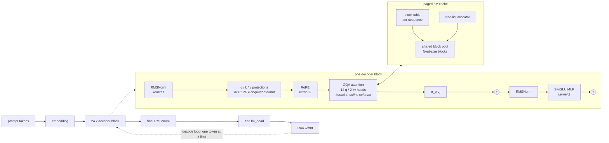

# nano-infer

A single-GPU LLM inference engine written from scratch — four custom CUDA kernels
and INT8/INT4 quantization — that loads an open-weights transformer and generates
tokens **without** `model.generate()`, vLLM, TensorRT-LLM, or FlashAttention.

It is the GPU-worker layer beneath [MiniDynamo](https://github.com/) *(link TBD)*,
a distributed KV-cache-aware inference router. MiniDynamo decides *which worker*
runs a request; nano-infer is what that worker actually does on the GPU.

> **Status: Phases 0–4 complete.** 118 tests passing.
> Full write-up: **[SUMMARY.md](SUMMARY.md)** — what was built, what was measured,
> and what went wrong. One lesson in depth: **[WRITEUP.md](WRITEUP.md)**.
> Current state: [ROADMAP.md](ROADMAP.md). Dated log: [PROGRESS.md](PROGRESS.md).

## The benchmark table

**Qwen2.5-0.5B-Instruct, fp16, RTX 3070, 32-token prompt, 64 new tokens, greedy.**
Median of 3 runs after 2 discarded warmups, on an idle GPU. Every row is
reproducible by a script in this repo.

| Engine | tok/s @ batch 1 | tok/s @ batch 32 | vs HF | Reproduce |
|---|---|---|---|---|
| HuggingFace `generate()` | 22.9 | 714.6 | 1.00× | `python -m bench.phase2_cache` |
| nano-infer, no cache (Phase 1) | 25.4 | 53.3 | 0.07× | `python -m bench.phase1_nocache` |
| nano-infer, paged KV cache (Phase 2) | 24.6 | 724.1 | 1.01× | `python -m bench.phase2_cache` |
| **nano-infer + custom kernels (Phase 3)** | **58.6** | **1739.1** | **2.43×** | `python -m bench.phase3_end_to_end` |
| nano-infer + INT8 weights (Phase 4) | 67.9 | 1274.9 | 1.78× | `python -m bench.quant_acceptance` |
| vLLM | — | — | — | **not run — see below** |

**The INT8 row is faster at batch 1 and slower at batch 32, and that is the
point.** It is not a worse engine; it is a different trade. See
[Quantization](#quantization-what-it-costs).

### The vLLM row is missing, and here is why

Rule 2 of this project is that vLLM is benchmarked *against*, never imported —
so a vLLM row belongs here. It could not be produced on this machine: vLLM
publishes **no Windows wheels**, and `pip install vllm` falls back to a source
build that fails to even unpack under Windows path-length limits. vLLM's
supported platform is Linux. Rather than quote a number from someone else's
hardware and pretend it is comparable, the row is left empty and labelled.

## Hardware

Every number in this repo comes from one machine: **NVIDIA GeForce RTX 3070**
(8 GB, Ampere sm_86, **448 GB/s** peak bandwidth, ~364 FLOP/byte roofline ridge).
Full spec, driver and toolchain: [HARDWARE.md](HARDWARE.md).

That 448 GB/s is the denominator for every bandwidth claim below. This machine
also runs a desktop, and benchmarks are only trusted when `nvidia-smi` reports
the GPU idle — a contended run produced ratios that disagreed with each other by
30% (ROADMAP gotcha #18).

## Architecture



Requests enter a **continuous-batching** scheduler: sequences join and leave the
running batch as they finish rather than waiting for the slowest one. Attention
reads the paged block table **in place**, so the gather copy that paging
normally pays each step is removed.

## What was built, phase by phase

| Phase | Result |
|---|---|
| **0 — Ground truth** | Benchmark harness (CUDA-synced, warmups discarded), HF baseline, committed reference fixture |
| **1 — Correct but slow** | Full forward pass from raw safetensors. Every component **bit-identical** to HF eager; token-for-token match on 5 prompts × 50 tokens |
| **2 — KV cache & batching** | Contiguous → paged cache (**3.8× fewer slots held**, 4.4% fragmentation) → continuous batching (**1.55×** on a request stream, slot utilization 46% → 100%) |
| **3 — Custom CUDA kernels** | Four kernels, **2.33× end-to-end** |
| **4 — Quantization** | INT8 lossless & 1.57× smaller; INT4 2.15× smaller, **1.99× less peak VRAM** |

### The four kernels

Measured against PyTorch on the same op. **% of peak** is achieved memory
bandwidth against 448 GB/s — the honest metric for a memory-bound kernel, since
"faster than PyTorch" says nothing about how much room is left.

| Kernel | Speedup | % of peak | Predicted ceiling | Reproduce |
|---|---|---|---|---|
| 1. Fused RMSNorm | 7.66× | 75.5% | — | `python -m bench.kernel_rmsnorm` |
| 2. Fused SwiGLU | 1.65× | 89.5% | 1.67× ✓ | `python -m bench.kernel_swiglu` |
| 3. Fused RoPE | 5.03× | 87.6% | 5.00× ✓ | `python -m bench.kernel_rope` |
| 4. Decode attention (online softmax) | 2.48× | 11.1% | ~24× ✗ | `python -m bench.kernel_attention` |

Kernels 2 and 3 landed within 1% of a ceiling derived by counting bytes before
any code was written. **Kernel 4 missed by 10×**, and finding out why is the
subject of [WRITEUP.md](WRITEUP.md).

## Quantization: what it costs

WikiText-2 test split, 8,176 predicted tokens. Reproduce:
`python -m bench.perplexity` and `python -m bench.quant_acceptance`.

| Precision | Weights | Compression | bits/wt | tok/s @1 | tok/s @32 | Peak VRAM | Perplexity | vs fp16 |
|---|---|---|---|---|---|---|---|---|
| fp16 | 988 MB | 1.00× | 16.00 | 57.9 | **1646.0** | 1030 MiB | 22.42 | — |
| **INT8** | 631 MB | 1.57× | 8.01 | **67.9** | 1274.9 | 682 MiB | 22.29 | −0.55% |
| INT4 g128 | 460 MB | 2.15× | 4.19 | 67.1 | 829.1 | **519 MiB** | 27.15 | +21.10% |

The `fp16` row here is the same configuration as the Phase 3 row in the
benchmark table (custom kernels, unquantized weights), re-measured by a different
script; the ~5% gap between 1646.0 and 1739.1 is run-to-run variance, not a
disagreement. Each table cites the script that produced it.

The fp16 perplexity baseline is **22.42 ± 3.45% (1 s.e.)**. INT8's −0.55% is
*inside* that error bar, so the honest claim is **"lossless within measurement
precision"** — not that quantization improved the model, which the raw sign
suggests. INT4's +21% is well outside it and is a real cost.

Three compression numbers are routinely conflated, so all three are given: the
quantized tensors shrink **3.82×**, the whole model **2.15×** (the tied embedding
stays fp16), and INT4 is **4.19 bits/weight, not 4.0**, because each group of 128
carries a scale and a zero point.

**INT8 is the configuration worth shipping at this model size.** INT4 doubles the
memory saving, buys nothing in speed, and costs 21% perplexity — round-to-nearest
with no calibration, on a 0.5B model with little redundancy to spare.

## Limitations

Stated plainly, because a repo that only lists wins is not reporting.

- **Decode attention runs at 11.1% of peak bandwidth.** It is latency-bound, not
  bandwidth-bound, and the diagnosis points at two specific fixes — split-K
  (flash-decoding proper) and one block per KV head — **neither of which is
  implemented**. This is the weakest number in the project.
- **The quantized matmul loses above batch ~4.** cuBLAS stays weight-bound to
  batch 32 and rides tensor cores; a scalar-fp32 dequant kernel cannot follow.
  INT4 at batch 32 is 0.50× fp16.
- **INT4 costs 21% perplexity.** Round-to-nearest, no GPTQ/AWQ calibration pass.
  Published INT4 results are better and are measured on much larger models.
- **Prefill is one request at a time** (`engine.py`), to avoid padding ragged
  prompts. A production engine batches or chunks prefills; at high admission
  rates this would bottleneck.
- **No vLLM comparison** (see above), and no multi-GPU, no speculative decoding,
  no FP8, no CUDA graphs.
- **One model, one GPU.** Everything here is Qwen2.5-0.5B on an RTX 3070.
  Conclusions about tensor cores and crossover points are properties of *this*
  hardware.
- **Benchmarks share a machine with a desktop.** Numbers are only taken when
  `nvidia-smi` reports the GPU idle; the scripts record what they saw and stamp
  it into `results/*.md`.

## Rules this project holds itself to

1. HuggingFace is used for **weights + tokenizer download only**. The forward
   pass, sampling loop, and cache are ours.
2. No vLLM / TensorRT-LLM / FlashAttention / xformers. We benchmark *against* them.
3. Every performance claim has a number, a methodology, and a hardware spec.
4. Correctness gates every optimization — numerical parity tests run first.
5. Regressions get reported, with numbers.

## Running it

System Python is not used; see [ROADMAP.md](ROADMAP.md) for the exact interpreter
path and environment notes.

```bash
python -m pytest tests/ -q          # 118 tests
python -m bench.phase3_end_to_end   # the headline number
python -m bench.quant_acceptance    # the quantization table
```

CUDA kernels JIT-compile on first use (~40 s), then cache.

## Layout

```
nano_infer/
  config.py      single source of truth: model, dtype, prompts, paths
  model.py       the engine. Phase 1 reference + cached/paged paths
  cache.py       KVCache, PagedKVCache, BlockAllocator
  engine.py      continuous batching scheduler
  quant.py       INT8 per-channel + INT4 group-wise
  kernels/       rmsnorm.cu, swiglu.cu, rope.cu, attention_decode.cu,
                 quant_matmul.cu
bench/           one benchmark per phase and per kernel
tests/           parity tests — the correctness answer keys
results/         committed benchmark outputs
```
